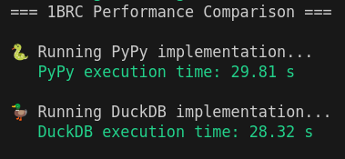

# 1 Billion Row Challenge (1BRC) - Python Implementation

<div align="center">



</div>

## About the Challenge

The 1 Billion Row Challenge (1BRC) is a performance challenge that involves processing 1 billion temperature measurements from weather stations. The task is to calculate the minimum, maximum, and average temperature for each weather station and present the results sorted by station name.

Each line in the input file follows the format:
```
<station_name>;<measurement>
```

For example:
```
Hamburg;12.0
Bulawayo;8.9
Palembang;38.8
```

The challenge tests the limits of data processing performance, requiring careful optimization of I/O, parsing, and aggregation operations.

## Installation

### Prerequisites

1. **Install uv** (Python package manager):
   ```bash
   curl -LsSf https://astral.sh/uv/install.sh | sh
   ```

2. **Install PyPy3**:
   ```bash
   # Ubuntu/Debian
   sudo apt install pypy3
   
   # macOS with Homebrew
   brew install pypy3
   ```

3. **Set up the project**:
   ```bash
   git clone <your-repo>
   cd 1brc
   uv sync
   ```

## Usage

### Data Preparation

First, generate the test data:
```bash
python create_measurements.py 1_000_000_000
```

This will create the `data/measurements.txt` file needed for the challenge.

### Running Individual Implementations

**PyPy Implementation:**
```bash
pypy3 test_pypy.py
```

**DuckDB Implementation:**
```bash
uv run python test_duckdb.py
```

### Performance Comparison

Run both implementations and compare results:
```bash
./run_stats.py
```

This will:
- Execute both implementations
- Display performance metrics
- Compare results to ensure correctness

## Pure Python Optimizations

The following optimizations were implemented in order of importance:

### 1. Using PyPy
PyPy's Just-In-Time (JIT) compiler provides significant speedups for CPU-intensive Python code, especially for loops and mathematical operations. This single change can provide 3-10x performance improvements.

### 2. Multiprocessing
Leveraging all available CPU cores by splitting the file into chunks and processing them in parallel. The implementation uses `min(cpu_count(), MAX_CPU_COUNT)` processes to avoid oversubscription. **MAX_CPU_COUNT=11** was a value that showed the best results on my hardware, based on several tests. 

### 3. Reading Bytes Instead of Strings
Working directly with bytes (`rb` mode) eliminates the overhead of UTF-8 decoding, which is unnecessary since we only need to parse ASCII numbers and station names.

### 4. Replacing Dictionary Values with Arrays
Using `array.array('l', [min, max, sum, count])` instead of regular Python lists or dictionaries for storing statistics. This reduces memory overhead and improves cache locality.

### 5. Custom `to_int()` Implementation
A highly optimized function that converts byte strings representing decimal numbers directly to integers without intermediate string conversions. This uses ASCII value arithmetic to parse numbers in a single pass.

## Lessons Learned

### 1. The Power of Choosing the Right Data Structure

When efficiency is critical, the choice of data structure can make or break performance. In this implementation:
- `array.array` vs `list`: Significant memory savings and better cache performance
- Direct byte processing vs string operations: Eliminates encoding/decoding overhead
- Chunked file processing vs single-threaded reading: Scales with available hardware

### 2. Architecture-Specific Performance Considerations

**Test System Specifications:**
- **CPU**: Intel(R) Core(TM) i7-10870H @ 2.20GHz (8 cores, 16 threads)
- **Architecture**: x86_64
- **Memory**: 16GB RAM
- **OS**: Ubuntu 22.04 

Performance optimizations are highly dependent on the target architecture. For example:
- Memory mapping (`mmap`) performs better on some systems (like M1 Macs) but adds overhead on Linux x86_64
- The optimal number of processes varies by CPU architecture and I/O subsystem
- Cache-friendly data structures have different impacts depending on CPU cache sizes

**Key takeaway**: Always benchmark on your target hardware. What works on one system may not be optimal on another.

### 3. The Risk of Performance Trickery

While the highly optimized Python solution achieves impressive performance, it comes with significant trade-offs:

**Risks:**
- **Code complexity**: The `to_int()` function is hard to understand and maintain
- **Bug-prone**: ASCII arithmetic can introduce subtle bugs if input assumptions change
- **Reduced readability**: Future developers will struggle to understand the optimizations
- **Brittle**: Small changes in input format could break the assumptions

**Alternative approach**: The DuckDB solution demonstrates that sometimes simplicity wins:
- 10 lines of readable SQL
- Handles edge cases automatically  
- Easy to understand and maintain
- Leverages highly optimized C++ implementation
- Often competitive performance for real-world use cases

### 4. When to Choose What

**Choose highly optimized Python when:**
- You have strict performance requirements
- The code will be maintained by performance-aware developers
- The input format is guaranteed to be stable
- You can afford extensive testing

**Choose DuckDB/SQL solutions when:**
- Code maintainability is important
- You need to handle various input formats
- Development time is constrained
- The performance difference is acceptable for your use case

## Thanks

Special thanks to:
- [dougmercer-yt](https://github.com/dougmercer-yt) for the `to_int()` implementation inspiration and introduction to this challenge
- The 1BRC community for sharing optimization techniques
- The PyPy team for creating an amazing Python implementation